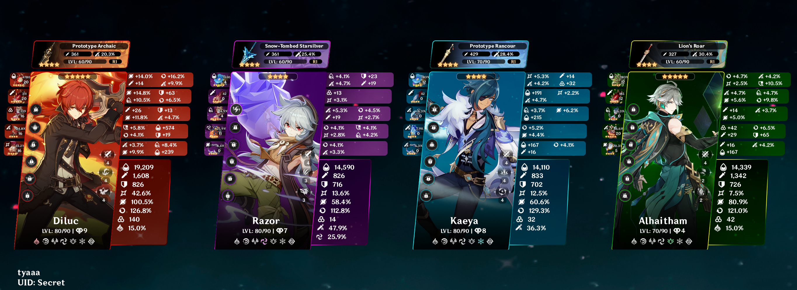

<h1 align="center">Joy's Anime Game Stats</h1>
<h3 align="center">🕒 Updated at <u>Jun 07, 2024 08:05 +0700</u></h3>
 

  

    
    Honkai Star Rail Details
  

  

    <h2>Profile</h2>
    
  

  

    <h2>
       Daily Rewards
    </h2>
    <table>
      <tr>
        <td>Total Rewards Claimed</td>
        <td>7</td>
      </tr>
      <tr>
        <td>Last Claimed Reward</td>
        <td>
          1 x
          
          Condensed Aether
        </td>
      </tr>
    </table>
  

  

    <h2>
      
      Stats
    </h2>
    <table>
      <tr>
        <td>Days Active</td>
        <td>41</td>
      </tr>
      <tr>
        <td>Total Avatar</td>
        <td>16</td>
      </tr>
      <tr>
        <td>Total Achievement</td>
        <td>92</td>
      </tr>
      <tr>
        <td>Chests Opened</td>
        <td>89</td>
      </tr>
    </table>
  

  

    <h2> Diary</h2>
    <table>
      <tr>
        <td>
           Stellar Jade
          earned
        </td>
        <td>0 (rate -100)</td>
      </tr>
      <tr>
        <td>
          
          Pass & Special Pass earned
        </td>
        <td>0 (rate -100)</td>
      </tr>
      <tr>
        <td>Categories</td>
        <td>
          Daily Activity: 0 (0%) Event: 0 (0%) Adventure Rewards: 0
          (0%) Simulated Universe: 0 (0%) Forgotten Hall: 0 (0%) Mail:
          0 (0%) Other: 0 (0%) 
        </td>
      </tr>
    </table>
  

  

    <h2>
      
      Characters
    </h2>
    

      
<b>Trailblazer </b>

       
      <table>
        <tr>
          <th><h3>Trailblazer</h3></th>
          <th><h3>Landau's Choice</h3></th>
        </tr>
        <tr>
          <td>
            

              
            

          </td>
          <td>
            

              
            

          </td>
        </tr>
        <tr>
          <td>
            <table>
              <tr>
                <td>Rarity</td>
                <td>★★★★★</td>
              </tr>
              <tr>
                <td>Element</td>
                <td>
                  
                </td>
              </tr>
              <tr>
                <td>Level</td>
                <td>40</td>
              </tr>
              <tr>
                <td>Eidolon</td>
                <td>0</td>
              </tr>
              <tr>
                <td>Relics</td>
                <td>
                  
                  Musketeer's Wild Wheat Felt Hat 
                  Knight's Silent Oath Ring 
                  Knight's Solemn Breastplate 
                  Thief's Meteor Boots 
                </td>
              </tr>
              <tr>
                <td>Planar</td>
                <td>
                  
                  Herta's Space Station 
                  Herta's Wandering Trek 
                </td>
              </tr>
            </table>
          </td>
          <td valign="top">
            <table>
              <tr>
                <td>Name</td>
                <td>Landau's Choice</td>
              </tr>
              <tr>
                <td>Level</td>
                <td>40</td>
              </tr>
              <tr>
                <td>Superimpose</td>
                <td>1</td>
              </tr>
            </table>
          </td>
        </tr>
      </table>
    

    

      
<b>Natasha </b>

       
      <table>
        <tr>
          <th><h3>Natasha</h3></th>
          <th><h3>Multiplication</h3></th>
        </tr>
        <tr>
          <td>
            

              
            

          </td>
          <td>
            

              
            

          </td>
        </tr>
        <tr>
          <td>
            <table>
              <tr>
                <td>Rarity</td>
                <td>★★★★</td>
              </tr>
              <tr>
                <td>Element</td>
                <td>
                  
                </td>
              </tr>
              <tr>
                <td>Level</td>
                <td>40</td>
              </tr>
              <tr>
                <td>Eidolon</td>
                <td>0</td>
              </tr>
              <tr>
                <td>Relics</td>
                <td>
                  
                  Musketeer's Wild Wheat Felt Hat 
                  Passerby's Roaming Dragon Bracer 
                  Musketeer's Wind-Hunting Shawl 
                  Passerby's Stygian Hiking Boots 
                </td>
              </tr>
            </table>
          </td>
          <td valign="top">
            <table>
              <tr>
                <td>Name</td>
                <td>Multiplication</td>
              </tr>
              <tr>
                <td>Level</td>
                <td>40</td>
              </tr>
              <tr>
                <td>Superimpose</td>
                <td>1</td>
              </tr>
            </table>
          </td>
        </tr>
      </table>
    

    

      
<b>Serval </b>

       
      <table>
        <tr>
          <th><h3>Serval</h3></th>
          <th><h3>Sagacity</h3></th>
        </tr>
        <tr>
          <td>
            

              
            

          </td>
          <td>
            

              
            

          </td>
        </tr>
        <tr>
          <td>
            <table>
              <tr>
                <td>Rarity</td>
                <td>★★★★</td>
              </tr>
              <tr>
                <td>Element</td>
                <td>
                  
                </td>
              </tr>
              <tr>
                <td>Level</td>
                <td>40</td>
              </tr>
              <tr>
                <td>Eidolon</td>
                <td>0</td>
              </tr>
              <tr>
                <td>Relics</td>
                <td>
                  
                  Musketeer's Wild Wheat Felt Hat 
                  Musketeer's Coarse Leather Gloves 
                  Musketeer's Wind-Hunting Shawl 
                  Musketeer's Rivets Riding Boots 
                </td>
              </tr>
            </table>
          </td>
          <td valign="top">
            <table>
              <tr>
                <td>Name</td>
                <td>Sagacity</td>
              </tr>
              <tr>
                <td>Level</td>
                <td>35</td>
              </tr>
              <tr>
                <td>Superimpose</td>
                <td>1</td>
              </tr>
            </table>
          </td>
        </tr>
      </table>
    

    

      
<b>Asta </b>

       
      <table>
        <tr>
          <th><h3>Asta</h3></th>
          <th><h3>Mediation</h3></th>
        </tr>
        <tr>
          <td>
            

              
            

          </td>
          <td>
            

              
            

          </td>
        </tr>
        <tr>
          <td>
            <table>
              <tr>
                <td>Rarity</td>
                <td>★★★★</td>
              </tr>
              <tr>
                <td>Element</td>
                <td>
                  
                </td>
              </tr>
              <tr>
                <td>Level</td>
                <td>40</td>
              </tr>
              <tr>
                <td>Eidolon</td>
                <td>1</td>
              </tr>
              <tr>
                <td>Relics</td>
                <td>
                  
                  Thief's Myriad-Faced Mask 
                  Musketeer's Coarse Leather Gloves 
                  Thief's Steel Grappling Hook 
                  Musketeer's Rivets Riding Boots 
                </td>
              </tr>
            </table>
          </td>
          <td valign="top">
            <table>
              <tr>
                <td>Name</td>
                <td>Mediation</td>
              </tr>
              <tr>
                <td>Level</td>
                <td>40</td>
              </tr>
              <tr>
                <td>Superimpose</td>
                <td>1</td>
              </tr>
            </table>
          </td>
        </tr>
      </table>
    

    

      
<b>Dan Heng </b>

       
      <table>
        <tr>
          <th><h3>Dan Heng</h3></th>
          <th><h3>Adversarial</h3></th>
        </tr>
        <tr>
          <td>
            

              
            

          </td>
          <td>
            

              
            

          </td>
        </tr>
        <tr>
          <td>
            <table>
              <tr>
                <td>Rarity</td>
                <td>★★★★</td>
              </tr>
              <tr>
                <td>Element</td>
                <td>
                  
                </td>
              </tr>
              <tr>
                <td>Level</td>
                <td>40</td>
              </tr>
              <tr>
                <td>Eidolon</td>
                <td>3</td>
              </tr>
              <tr>
                <td>Relics</td>
                <td>
                  
                  Thief's Myriad-Faced Mask 
                  Passerby's Roaming Dragon Bracer 
                  Musketeer's Wind-Hunting Shawl 
                  Musketeer's Rivets Riding Boots 
                </td>
              </tr>
            </table>
          </td>
          <td valign="top">
            <table>
              <tr>
                <td>Name</td>
                <td>Adversarial</td>
              </tr>
              <tr>
                <td>Level</td>
                <td>40</td>
              </tr>
              <tr>
                <td>Superimpose</td>
                <td>1</td>
              </tr>
            </table>
          </td>
        </tr>
      </table>
    

    

      
<b>March 7th </b>

       
      <table>
        <tr>
          <th><h3>March 7th</h3></th>
          <th><h3>Amber</h3></th>
        </tr>
        <tr>
          <td>
            

              
            

          </td>
          <td>
            

              
            

          </td>
        </tr>
        <tr>
          <td>
            <table>
              <tr>
                <td>Rarity</td>
                <td>★★★★</td>
              </tr>
              <tr>
                <td>Element</td>
                <td>
                  
                </td>
              </tr>
              <tr>
                <td>Level</td>
                <td>40</td>
              </tr>
              <tr>
                <td>Eidolon</td>
                <td>0</td>
              </tr>
              <tr>
                <td>Relics</td>
                <td>
                  
                  Firesmith's Obsidian Goggles 
                  Thief's Gloves With Prints 
                  Thief's Steel Grappling Hook 
                  Knight's Iron Boots of Order 
                </td>
              </tr>
            </table>
          </td>
          <td valign="top">
            <table>
              <tr>
                <td>Name</td>
                <td>Amber</td>
              </tr>
              <tr>
                <td>Level</td>
                <td>30</td>
              </tr>
              <tr>
                <td>Superimpose</td>
                <td>1</td>
              </tr>
            </table>
          </td>
        </tr>
      </table>
    

    

      
<b>Clara </b>

       
      <table>
        <tr>
          <th><h3>Clara</h3></th>
          <th><h3>Collapsing Sky</h3></th>
        </tr>
        <tr>
          <td>
            

              
            

          </td>
          <td>
            

              
            

          </td>
        </tr>
        <tr>
          <td>
            <table>
              <tr>
                <td>Rarity</td>
                <td>★★★★★</td>
              </tr>
              <tr>
                <td>Element</td>
                <td>
                  
                </td>
              </tr>
              <tr>
                <td>Level</td>
                <td>20</td>
              </tr>
              <tr>
                <td>Eidolon</td>
                <td>0</td>
              </tr>
              <tr>
                <td>Relics</td>
                <td>
                  
                  Musketeer's Wild Wheat Felt Hat 
                  Thief's Gloves With Prints 
                  Thief's Steel Grappling Hook 
                  Musketeer's Rivets Riding Boots 
                </td>
              </tr>
            </table>
          </td>
          <td valign="top">
            <table>
              <tr>
                <td>Name</td>
                <td>Collapsing Sky</td>
              </tr>
              <tr>
                <td>Level</td>
                <td>1</td>
              </tr>
              <tr>
                <td>Superimpose</td>
                <td>1</td>
              </tr>
            </table>
          </td>
        </tr>
      </table>
    

    

      
<b>Dr. Ratio </b>

       
      <table>
        <tr>
          <th><h3>Dr. Ratio</h3></th>
          <th><h3></h3></th>
        </tr>
        <tr>
          <td>
            

              
            

          </td>
          <td>
            

          </td>
        </tr>
        <tr>
          <td>
            <table>
              <tr>
                <td>Rarity</td>
                <td>★★★★★</td>
              </tr>
              <tr>
                <td>Element</td>
                <td>
                  
                </td>
              </tr>
              <tr>
                <td>Level</td>
                <td>1</td>
              </tr>
              <tr>
                <td>Eidolon</td>
                <td>0</td>
              </tr>
              <tr>
                <td>Relics</td>
                <td></td>
              </tr>
            </table>
          </td>
          <td valign="top">
            <table>
              <tr>
                <td>Name</td>
                <td></td>
              </tr>
              <tr>
                <td>Level</td>
                <td></td>
              </tr>
              <tr>
                <td>Superimpose</td>
                <td></td>
              </tr>
            </table>
          </td>
        </tr>
      </table>
    

    

      
<b>Bronya </b>

       
      <table>
        <tr>
          <th><h3>Bronya</h3></th>
          <th><h3></h3></th>
        </tr>
        <tr>
          <td>
            

              
            

          </td>
          <td>
            

          </td>
        </tr>
        <tr>
          <td>
            <table>
              <tr>
                <td>Rarity</td>
                <td>★★★★★</td>
              </tr>
              <tr>
                <td>Element</td>
                <td>
                  
                </td>
              </tr>
              <tr>
                <td>Level</td>
                <td>1</td>
              </tr>
              <tr>
                <td>Eidolon</td>
                <td>0</td>
              </tr>
              <tr>
                <td>Relics</td>
                <td></td>
              </tr>
            </table>
          </td>
          <td valign="top">
            <table>
              <tr>
                <td>Name</td>
                <td></td>
              </tr>
              <tr>
                <td>Level</td>
                <td></td>
              </tr>
              <tr>
                <td>Superimpose</td>
                <td></td>
              </tr>
            </table>
          </td>
        </tr>
      </table>
    

    

      
<b>Misha </b>

       
      <table>
        <tr>
          <th><h3>Misha</h3></th>
          <th><h3></h3></th>
        </tr>
        <tr>
          <td>
            

              
            

          </td>
          <td>
            

          </td>
        </tr>
        <tr>
          <td>
            <table>
              <tr>
                <td>Rarity</td>
                <td>★★★★</td>
              </tr>
              <tr>
                <td>Element</td>
                <td>
                  
                </td>
              </tr>
              <tr>
                <td>Level</td>
                <td>1</td>
              </tr>
              <tr>
                <td>Eidolon</td>
                <td>0</td>
              </tr>
              <tr>
                <td>Relics</td>
                <td></td>
              </tr>
            </table>
          </td>
          <td valign="top">
            <table>
              <tr>
                <td>Name</td>
                <td></td>
              </tr>
              <tr>
                <td>Level</td>
                <td></td>
              </tr>
              <tr>
                <td>Superimpose</td>
                <td></td>
              </tr>
            </table>
          </td>
        </tr>
      </table>
    

    

      
<b>Xueyi </b>

       
      <table>
        <tr>
          <th><h3>Xueyi</h3></th>
          <th><h3></h3></th>
        </tr>
        <tr>
          <td>
            

              
            

          </td>
          <td>
            

          </td>
        </tr>
        <tr>
          <td>
            <table>
              <tr>
                <td>Rarity</td>
                <td>★★★★</td>
              </tr>
              <tr>
                <td>Element</td>
                <td>
                  
                </td>
              </tr>
              <tr>
                <td>Level</td>
                <td>1</td>
              </tr>
              <tr>
                <td>Eidolon</td>
                <td>0</td>
              </tr>
              <tr>
                <td>Relics</td>
                <td></td>
              </tr>
            </table>
          </td>
          <td valign="top">
            <table>
              <tr>
                <td>Name</td>
                <td></td>
              </tr>
              <tr>
                <td>Level</td>
                <td></td>
              </tr>
              <tr>
                <td>Superimpose</td>
                <td></td>
              </tr>
            </table>
          </td>
        </tr>
      </table>
    

    

      
<b>Luka </b>

       
      <table>
        <tr>
          <th><h3>Luka</h3></th>
          <th><h3></h3></th>
        </tr>
        <tr>
          <td>
            

              
            

          </td>
          <td>
            

          </td>
        </tr>
        <tr>
          <td>
            <table>
              <tr>
                <td>Rarity</td>
                <td>★★★★</td>
              </tr>
              <tr>
                <td>Element</td>
                <td>
                  
                </td>
              </tr>
              <tr>
                <td>Level</td>
                <td>1</td>
              </tr>
              <tr>
                <td>Eidolon</td>
                <td>1</td>
              </tr>
              <tr>
                <td>Relics</td>
                <td></td>
              </tr>
            </table>
          </td>
          <td valign="top">
            <table>
              <tr>
                <td>Name</td>
                <td></td>
              </tr>
              <tr>
                <td>Level</td>
                <td></td>
              </tr>
              <tr>
                <td>Superimpose</td>
                <td></td>
              </tr>
            </table>
          </td>
        </tr>
      </table>
    

    

      
<b>Hook </b>

       
      <table>
        <tr>
          <th><h3>Hook</h3></th>
          <th><h3>Under the Blue Sky</h3></th>
        </tr>
        <tr>
          <td>
            

              
            

          </td>
          <td>
            

              
            

          </td>
        </tr>
        <tr>
          <td>
            <table>
              <tr>
                <td>Rarity</td>
                <td>★★★★</td>
              </tr>
              <tr>
                <td>Element</td>
                <td>
                  
                </td>
              </tr>
              <tr>
                <td>Level</td>
                <td>1</td>
              </tr>
              <tr>
                <td>Eidolon</td>
                <td>0</td>
              </tr>
              <tr>
                <td>Relics</td>
                <td>
                  
                  Thief's Myriad-Faced Mask 
                  Thief's Gloves With Prints 
                  Thief's Steel Grappling Hook 
                  Thief's Meteor Boots 
                </td>
              </tr>
            </table>
          </td>
          <td valign="top">
            <table>
              <tr>
                <td>Name</td>
                <td>Under the Blue Sky</td>
              </tr>
              <tr>
                <td>Level</td>
                <td>16</td>
              </tr>
              <tr>
                <td>Superimpose</td>
                <td>1</td>
              </tr>
            </table>
          </td>
        </tr>
      </table>
    

    

      
<b>Sampo </b>

       
      <table>
        <tr>
          <th><h3>Sampo</h3></th>
          <th><h3></h3></th>
        </tr>
        <tr>
          <td>
            

              
            

          </td>
          <td>
            

          </td>
        </tr>
        <tr>
          <td>
            <table>
              <tr>
                <td>Rarity</td>
                <td>★★★★</td>
              </tr>
              <tr>
                <td>Element</td>
                <td>
                  
                </td>
              </tr>
              <tr>
                <td>Level</td>
                <td>1</td>
              </tr>
              <tr>
                <td>Eidolon</td>
                <td>0</td>
              </tr>
              <tr>
                <td>Relics</td>
                <td></td>
              </tr>
            </table>
          </td>
          <td valign="top">
            <table>
              <tr>
                <td>Name</td>
                <td></td>
              </tr>
              <tr>
                <td>Level</td>
                <td></td>
              </tr>
              <tr>
                <td>Superimpose</td>
                <td></td>
              </tr>
            </table>
          </td>
        </tr>
      </table>
    

    

      
<b>Pela </b>

       
      <table>
        <tr>
          <th><h3>Pela</h3></th>
          <th><h3>Void</h3></th>
        </tr>
        <tr>
          <td>
            

              
            

          </td>
          <td>
            

              
            

          </td>
        </tr>
        <tr>
          <td>
            <table>
              <tr>
                <td>Rarity</td>
                <td>★★★★</td>
              </tr>
              <tr>
                <td>Element</td>
                <td>
                  
                </td>
              </tr>
              <tr>
                <td>Level</td>
                <td>1</td>
              </tr>
              <tr>
                <td>Eidolon</td>
                <td>3</td>
              </tr>
              <tr>
                <td>Relics</td>
                <td></td>
              </tr>
            </table>
          </td>
          <td valign="top">
            <table>
              <tr>
                <td>Name</td>
                <td>Void</td>
              </tr>
              <tr>
                <td>Level</td>
                <td>1</td>
              </tr>
              <tr>
                <td>Superimpose</td>
                <td>1</td>
              </tr>
            </table>
          </td>
        </tr>
      </table>
    

    

      
<b>Herta </b>

       
      <table>
        <tr>
          <th><h3>Herta</h3></th>
          <th><h3>Sagacity</h3></th>
        </tr>
        <tr>
          <td>
            

              
            

          </td>
          <td>
            

              
            

          </td>
        </tr>
        <tr>
          <td>
            <table>
              <tr>
                <td>Rarity</td>
                <td>★★★★</td>
              </tr>
              <tr>
                <td>Element</td>
                <td>
                  
                </td>
              </tr>
              <tr>
                <td>Level</td>
                <td>1</td>
              </tr>
              <tr>
                <td>Eidolon</td>
                <td>1</td>
              </tr>
              <tr>
                <td>Relics</td>
                <td>
                  
                  Musketeer's Wild Wheat Felt Hat 
                  Musketeer's Coarse Leather Gloves 
                  Musketeer's Wind-Hunting Shawl 
                  Musketeer's Rivets Riding Boots 
                </td>
              </tr>
            </table>
          </td>
          <td valign="top">
            <table>
              <tr>
                <td>Name</td>
                <td>Sagacity</td>
              </tr>
              <tr>
                <td>Level</td>
                <td>1</td>
              </tr>
              <tr>
                <td>Superimpose</td>
                <td>1</td>
              </tr>
            </table>
          </td>
        </tr>
      </table>
    

  

  

    
    Genshin Impact Details
  

  

    <h2>Profile</h2>
    
  

  

    <h2>
       Daily Rewards
    </h2>
    <table>
      <tr>
        <td>Total Rewards Claimed</td>
        <td>7</td>
      </tr>
      <tr>
        <td>Last Claimed Reward</td>
        <td>
          8000 x
          
          Mora
        </td>
      </tr>
    </table>
  

  

    <h2>
      
      Stats
    </h2>
    <table>
      <tr>
        <td>Achievements</td>
        <td>298</td>
      </tr>
      <tr>
        <td>Days Active</td>
        <td>182</td>
      </tr>
      <tr>
        <td>Characters</td>
        <td>30</td>
      </tr>
      <tr>
        <td>Waypoints Unlocked</td>
        <td>287</td>
      </tr>
      <tr>
        <td>Anemoculi</td>
        <td>66</td>
      </tr>
      <tr>
        <td>Geoculi</td>
        <td>131</td>
      </tr>
      <tr>
        <td>Dendroculi</td>
        <td>13</td>
      </tr>
      <tr>
        <td>Electroculi</td>
        <td>67</td>
      </tr>
      <tr>
        <td>Hydroculi</td>
        <td>32</td>
      </tr>
      <tr>
        <td>Common Chests Opened</td>
        <td>418</td>
      </tr>
      <tr>
        <td>Exquisite Chests Opened</td>
        <td>424</td>
      </tr>
      <tr>
        <td>Precious Chests Opened</td>
        <td>136</td>
      </tr>
      <tr>
        <td>Luxurious Chests Opened</td>
        <td>55</td>
      </tr>
      <tr>
        <td>Remarkable Chests Opened</td>
        <td>4</td>
      </tr>
      <tr>
        <td>Domains Unlocked</td>
        <td>30</td>
      </tr>
    </table>
  

  

    <h2>
      
      Exploration
    </h2>
    <table>
      <tr>
        <th>Chenyu Vale: Upper Vale</th>
        <th>Chenyu Vale: Southern Mountain</th>
        <th>Fontaine</th>
        <th>Sumeru</th>
        <th>The Chasm: Underground Mines</th>
        <th>The Chasm</th>
        <th>Enkanomiya</th>
        <th>Inazuma</th>
        <th>Dragonspine</th>
        <th>Liyue</th>
        <th>Mondstadt</th>
        <th>Chenyu Vale</th>
      </tr>
      <tr>
        <td>
          

            
          

        </td>
        <td>
          

            
          

        </td>
        <td>
          

            
          

        </td>
        <td>
          

            
          

        </td>
        <td>
          

            
          

        </td>
        <td>
          

            
          

        </td>
        <td>
          

            
          

        </td>
        <td>
          

            
          

        </td>
        <td>
          

            
          

        </td>
        <td>
          

            
          

        </td>
        <td>
          

            
          

        </td>
        <td>
          

            
          

        </td>
      </tr>
      <tr>
        <td>
          <table>
            <tr>
              <td>Explored</td>
              <td>
                
              </td>
            </tr>
            <tr>
              <td>TypeUnknow</td>
              <td>0</td>
            </tr>
          </table>
        </td>
        <td>
          <table>
            <tr>
              <td>Explored</td>
              <td>
                
              </td>
            </tr>
            <tr>
              <td>TypeUnknow</td>
              <td>0</td>
            </tr>
          </table>
        </td>
        <td>
          <table>
            <tr>
              <td>Explored</td>
              <td>
                
              </td>
            </tr>
            <tr>
              <td>Reputation</td>
              <td>1</td>
            </tr>
          </table>
        </td>
        <td>
          <table>
            <tr>
              <td>Explored</td>
              <td>
                
              </td>
            </tr>
            <tr>
              <td>Reputation</td>
              <td>1</td>
            </tr>
          </table>
        </td>
        <td>
          <table>
            <tr>
              <td>Explored</td>
              <td>
                
              </td>
            </tr>
            <tr>
              <td>Offering</td>
              <td>4</td>
            </tr>
          </table>
        </td>
        <td>
          <table>
            <tr>
              <td>Explored</td>
              <td>
                
              </td>
            </tr>
            <tr>
              <td>Offering</td>
              <td>4</td>
            </tr>
          </table>
        </td>
        <td>
          <table>
            <tr>
              <td>Explored</td>
              <td>
                
              </td>
            </tr>
            <tr>
              <td>Offering</td>
              <td>0</td>
            </tr>
          </table>
        </td>
        <td>
          <table>
            <tr>
              <td>Explored</td>
              <td>
                
              </td>
            </tr>
            <tr>
              <td>Reputation</td>
              <td>2</td>
            </tr>
          </table>
        </td>
        <td>
          <table>
            <tr>
              <td>Explored</td>
              <td>
                
              </td>
            </tr>
            <tr>
              <td>Offering</td>
              <td>5</td>
            </tr>
          </table>
        </td>
        <td>
          <table>
            <tr>
              <td>Explored</td>
              <td>
                
              </td>
            </tr>
            <tr>
              <td>Reputation</td>
              <td>3</td>
            </tr>
          </table>
        </td>
        <td>
          <table>
            <tr>
              <td>Explored</td>
              <td>
                
              </td>
            </tr>
            <tr>
              <td>Reputation</td>
              <td>3</td>
            </tr>
          </table>
        </td>
        <td>
          <table>
            <tr>
              <td>Explored</td>
              <td>
                
              </td>
            </tr>
            <tr>
              <td>Offering</td>
              <td>0</td>
            </tr>
          </table>
        </td>
      </tr>
    </table>
  

  

    <h2>
      
      Teapot
    </h2>
    <table>
      <tr>
        <td>Level</td>
        <td>1</td>
      </tr>
      <tr>
        <td>Comfort</td>
        <td>Humble Abode (2100)</td>
      </tr>
      <tr>
        <td>Items</td>
        <td>55</td>
      </tr>
      <tr>
        <td>Visitors</td>
        <td>1</td>
      </tr>
    </table>
  

  

    <h2> Diary</h2>
    <table>
      <tr>
        <td>
          
          Primogems earned
        </td>
        <td>0 (rate -100)</td>
      </tr>
      <tr>
        <td>
          
          Mora earned
        </td>
        <td>0 (rate -100)</td>
      </tr>
      <tr>
        <td>Categories</td>
        <td>
          Events: 0 (0%) Daily Activity: 0 (0%) Spiral Abyss: 0
          (0%) Quests: 0 (0%) Adventure: 0 (0%) Mail: 0 (0%) Other:
          0 (0%) 
        </td>
      </tr>
    </table>
  

  

    <h2>
      
      Characters
    </h2>
    

      
<b>Diluc</b>

       
      <table>
        <tr>
          <th><h3 align="center">Diluc</h3></th>
          <th><h3 align="center">Prototype Archaic</h3></th>
        </tr>
        <tr>
          <td>
            

              
            

          </td>
          <td>
            

              
            

          </td>
        </tr>
        <tr>
          <td>
            <table>
              <tr>
                <td>Rarity</td>
                <td>★★★★★</td>
              </tr>
              <tr>
                <td>Element</td>
                <td>
                  
                </td>
              </tr>
              <tr>
                <td>Level</td>
                <td>80</td>
              </tr>
              <tr>
                <td>Friendship</td>
                <td>9</td>
              </tr>
              <tr>
                <td>Constellation</td>
                <td>0</td>
              </tr>
              <tr>
                <td>
                  Artifacts 2 x Crimson Witch of Flames 2 x
                  Gladiator's Finale 1 x Martial Artist 
                </td>
                <td>
                  
                  Witch's Flower of Blaze 
                  Witch's Ever-Burning Plume 
                  Gladiator's Longing 
                  Martial Artist's Wine Cup 
                  Gladiator's Triumphus 
                </td>
              </tr>
              <tr>
                <td>Outfits</td>
                <td></td>
              </tr>
            </table>
          </td>
          <td valign="top">
            <table>
              <tr>
                <td>Name</td>
                <td>Prototype Archaic</td>
              </tr>
              <tr>
                <td>Rarity</td>
                <td>★★★★</td>
              </tr>
              <tr>
                <td>Level</td>
                <td>60</td>
              </tr>
              <tr>
                <td>Refinement</td>
                <td>1</td>
              </tr>
            </table>
          </td>
        </tr>
      </table>
    

    

      
<b>Kaeya</b>

       
      <table>
        <tr>
          <th><h3 align="center">Kaeya</h3></th>
          <th><h3 align="center">Prototype Rancour</h3></th>
        </tr>
        <tr>
          <td>
            

              
            

          </td>
          <td>
            

              
            

          </td>
        </tr>
        <tr>
          <td>
            <table>
              <tr>
                <td>Rarity</td>
                <td>★★★★</td>
              </tr>
              <tr>
                <td>Element</td>
                <td>
                  
                </td>
              </tr>
              <tr>
                <td>Level</td>
                <td>80</td>
              </tr>
              <tr>
                <td>Friendship</td>
                <td>8</td>
              </tr>
              <tr>
                <td>Constellation</td>
                <td>0</td>
              </tr>
              <tr>
                <td>
                  Artifacts 1 x Wanderer's Troupe 1 x Berserker 1
                  x The Exile 1 x Blizzard Strayer 1 x Prayers for
                  Destiny 
                </td>
                <td>
                  
                  Troupe's Dawnlight 
                  Berserker's Indigo Feather 
                  Exile's Pocket Watch 
                  Frost-Weaved Dignity 
                  Tiara of Torrents 
                </td>
              </tr>
              <tr>
                <td>Outfits</td>
                <td></td>
              </tr>
            </table>
          </td>
          <td valign="top">
            <table>
              <tr>
                <td>Name</td>
                <td>Prototype Rancour</td>
              </tr>
              <tr>
                <td>Rarity</td>
                <td>★★★★</td>
              </tr>
              <tr>
                <td>Level</td>
                <td>70</td>
              </tr>
              <tr>
                <td>Refinement</td>
                <td>1</td>
              </tr>
            </table>
          </td>
        </tr>
      </table>
    

    

      
<b>Razor</b>

       
      <table>
        <tr>
          <th><h3 align="center">Razor</h3></th>
          <th><h3 align="center">Snow-Tombed Starsilver</h3></th>
        </tr>
        <tr>
          <td>
            

              
            

          </td>
          <td>
            

              
            

          </td>
        </tr>
        <tr>
          <td>
            <table>
              <tr>
                <td>Rarity</td>
                <td>★★★★</td>
              </tr>
              <tr>
                <td>Element</td>
                <td>
                  
                </td>
              </tr>
              <tr>
                <td>Level</td>
                <td>80</td>
              </tr>
              <tr>
                <td>Friendship</td>
                <td>7</td>
              </tr>
              <tr>
                <td>Constellation</td>
                <td>1</td>
              </tr>
              <tr>
                <td>
                  Artifacts 1 x Wanderer's Troupe 2 x Gladiator's
                  Finale 1 x Retracing Bolide 1 x Prayers for
                  Wisdom 
                </td>
                <td>
                  
                  Troupe's Dawnlight 
                  Gladiator's Destiny 
                  Gladiator's Longing 
                  Summer Night's Waterballoon 
                  Tiara of Thunder 
                </td>
              </tr>
              <tr>
                <td>Outfits</td>
                <td></td>
              </tr>
            </table>
          </td>
          <td valign="top">
            <table>
              <tr>
                <td>Name</td>
                <td>Snow-Tombed Starsilver</td>
              </tr>
              <tr>
                <td>Rarity</td>
                <td>★★★★</td>
              </tr>
              <tr>
                <td>Level</td>
                <td>60</td>
              </tr>
              <tr>
                <td>Refinement</td>
                <td>1</td>
              </tr>
            </table>
          </td>
        </tr>
      </table>
    

    

      
<b>Xingqiu</b>

       
      <table>
        <tr>
          <th><h3 align="center">Xingqiu</h3></th>
          <th><h3 align="center">The Flute</h3></th>
        </tr>
        <tr>
          <td>
            

              
            

          </td>
          <td>
            

              
            

          </td>
        </tr>
        <tr>
          <td>
            <table>
              <tr>
                <td>Rarity</td>
                <td>★★★★</td>
              </tr>
              <tr>
                <td>Element</td>
                <td>
                  
                </td>
              </tr>
              <tr>
                <td>Level</td>
                <td>70</td>
              </tr>
              <tr>
                <td>Friendship</td>
                <td>5</td>
              </tr>
              <tr>
                <td>Constellation</td>
                <td>2</td>
              </tr>
              <tr>
                <td>
                  Artifacts 2 x Heart of Depth 1 x Maiden Beloved 1
                  x Berserker 1 x Prayers for Illumination 
                </td>
                <td>
                  
                  Gilded Corsage 
                  Gust of Nostalgia 
                  Maiden's Passing Youth 
                  Berserker's Bone Goblet 
                  Tiara of Flame 
                </td>
              </tr>
              <tr>
                <td>Outfits</td>
                <td></td>
              </tr>
            </table>
          </td>
          <td valign="top">
            <table>
              <tr>
                <td>Name</td>
                <td>The Flute</td>
              </tr>
              <tr>
                <td>Rarity</td>
                <td>★★★★</td>
              </tr>
              <tr>
                <td>Level</td>
                <td>50</td>
              </tr>
              <tr>
                <td>Refinement</td>
                <td>1</td>
              </tr>
            </table>
          </td>
        </tr>
      </table>
    

    

      
<b>Alhaitham</b>

       
      <table>
        <tr>
          <th><h3 align="center">Alhaitham</h3></th>
          <th><h3 align="center">Lion's Roar</h3></th>
        </tr>
        <tr>
          <td>
            

              
            

          </td>
          <td>
            

              
            

          </td>
        </tr>
        <tr>
          <td>
            <table>
              <tr>
                <td>Rarity</td>
                <td>★★★★★</td>
              </tr>
              <tr>
                <td>Element</td>
                <td>
                  
                </td>
              </tr>
              <tr>
                <td>Level</td>
                <td>70</td>
              </tr>
              <tr>
                <td>Friendship</td>
                <td>4</td>
              </tr>
              <tr>
                <td>Constellation</td>
                <td>0</td>
              </tr>
              <tr>
                <td>
                  Artifacts 1 x Deepwood Memories 2 x Crimson Witch of
                  Flames 1 x Berserker 1 x Scholar 
                </td>
                <td>
                  
                  Labyrinth Wayfarer 
                  Witch's Ever-Burning Plume 
                  Berserker's Timepiece 
                  Witch's Heart Flames 
                  Scholar's Lens 
                </td>
              </tr>
              <tr>
                <td>Outfits</td>
                <td></td>
              </tr>
            </table>
          </td>
          <td valign="top">
            <table>
              <tr>
                <td>Name</td>
                <td>Lion's Roar</td>
              </tr>
              <tr>
                <td>Rarity</td>
                <td>★★★★</td>
              </tr>
              <tr>
                <td>Level</td>
                <td>60</td>
              </tr>
              <tr>
                <td>Refinement</td>
                <td>1</td>
              </tr>
            </table>
          </td>
        </tr>
      </table>
    

    

      
<b>Fischl</b>

       
      <table>
        <tr>
          <th><h3 align="center">Fischl</h3></th>
          <th><h3 align="center">Sacrificial Bow</h3></th>
        </tr>
        <tr>
          <td>
            

              
            

          </td>
          <td>
            

              
            

          </td>
        </tr>
        <tr>
          <td>
            <table>
              <tr>
                <td>Rarity</td>
                <td>★★★★</td>
              </tr>
              <tr>
                <td>Element</td>
                <td>
                  
                </td>
              </tr>
              <tr>
                <td>Level</td>
                <td>60</td>
              </tr>
              <tr>
                <td>Friendship</td>
                <td>3</td>
              </tr>
              <tr>
                <td>Constellation</td>
                <td>0</td>
              </tr>
              <tr>
                <td>
                  Artifacts 1 x Maiden Beloved 2 x The Exile 1 x
                  Berserker 1 x Wanderer's Troupe 
                </td>
                <td>
                  
                  Maiden's Distant Love 
                  Exile's Feather 
                  Berserker's Timepiece 
                  Wanderer's String-Kettle 
                  Exile's Circlet 
                </td>
              </tr>
              <tr>
                <td>Outfits</td>
                <td></td>
              </tr>
            </table>
          </td>
          <td valign="top">
            <table>
              <tr>
                <td>Name</td>
                <td>Sacrificial Bow</td>
              </tr>
              <tr>
                <td>Rarity</td>
                <td>★★★★</td>
              </tr>
              <tr>
                <td>Level</td>
                <td>50</td>
              </tr>
              <tr>
                <td>Refinement</td>
                <td>1</td>
              </tr>
            </table>
          </td>
        </tr>
      </table>
    

    

      
<b>Ningguang</b>

       
      <table>
        <tr>
          <th><h3 align="center">Ningguang</h3></th>
          <th><h3 align="center">The Widsith</h3></th>
        </tr>
        <tr>
          <td>
            

              
            

          </td>
          <td>
            

              
            

          </td>
        </tr>
        <tr>
          <td>
            <table>
              <tr>
                <td>Rarity</td>
                <td>★★★★</td>
              </tr>
              <tr>
                <td>Element</td>
                <td>
                  
                </td>
              </tr>
              <tr>
                <td>Level</td>
                <td>60</td>
              </tr>
              <tr>
                <td>Friendship</td>
                <td>2</td>
              </tr>
              <tr>
                <td>Constellation</td>
                <td>3</td>
              </tr>
              <tr>
                <td>
                  Artifacts 1 x Instructor 1 x The Exile 1 x
                  Martial Artist 1 x Crimson Witch of Flames 1 x
                  Wanderer's Troupe 
                </td>
                <td>
                  
                  Instructor's Brooch 
                  Exile's Feather 
                  Martial Artist's Water Hourglass 
                  Witch's Heart Flames 
                  Conductor's Top Hat 
                </td>
              </tr>
              <tr>
                <td>Outfits</td>
                <td>Orchid's Evening Gown</td>
              </tr>
            </table>
          </td>
          <td valign="top">
            <table>
              <tr>
                <td>Name</td>
                <td>The Widsith</td>
              </tr>
              <tr>
                <td>Rarity</td>
                <td>★★★★</td>
              </tr>
              <tr>
                <td>Level</td>
                <td>20</td>
              </tr>
              <tr>
                <td>Refinement</td>
                <td>1</td>
              </tr>
            </table>
          </td>
        </tr>
      </table>
    

    

      
<b>Lyney</b>

       
      <table>
        <tr>
          <th><h3 align="center">Lyney</h3></th>
          <th><h3 align="center">The Stringless</h3></th>
        </tr>
        <tr>
          <td>
            

              
            

          </td>
          <td>
            

              
            

          </td>
        </tr>
        <tr>
          <td>
            <table>
              <tr>
                <td>Rarity</td>
                <td>★★★★★</td>
              </tr>
              <tr>
                <td>Element</td>
                <td>
                  
                </td>
              </tr>
              <tr>
                <td>Level</td>
                <td>60</td>
              </tr>
              <tr>
                <td>Friendship</td>
                <td>1</td>
              </tr>
              <tr>
                <td>Constellation</td>
                <td>0</td>
              </tr>
              <tr>
                <td>
                  Artifacts 2 x Crimson Witch of Flames 1 x
                  Instructor 1 x Lavawalker 1 x Prayers for Destiny 
                </td>
                <td>
                  
                  Witch's Flower of Blaze 
                  Witch's Ever-Burning Plume 
                  Instructor's Pocket Watch 
                  Lavawalker's Epiphany 
                  Tiara of Torrents 
                </td>
              </tr>
              <tr>
                <td>Outfits</td>
                <td></td>
              </tr>
            </table>
          </td>
          <td valign="top">
            <table>
              <tr>
                <td>Name</td>
                <td>The Stringless</td>
              </tr>
              <tr>
                <td>Rarity</td>
                <td>★★★★</td>
              </tr>
              <tr>
                <td>Level</td>
                <td>50</td>
              </tr>
              <tr>
                <td>Refinement</td>
                <td>1</td>
              </tr>
            </table>
          </td>
        </tr>
      </table>
    

    

      
<b>Bennett</b>

       
      <table>
        <tr>
          <th><h3 align="center">Bennett</h3></th>
          <th><h3 align="center">Lion's Roar</h3></th>
        </tr>
        <tr>
          <td>
            

              
            

          </td>
          <td>
            

              
            

          </td>
        </tr>
        <tr>
          <td>
            <table>
              <tr>
                <td>Rarity</td>
                <td>★★★★</td>
              </tr>
              <tr>
                <td>Element</td>
                <td>
                  
                </td>
              </tr>
              <tr>
                <td>Level</td>
                <td>50</td>
              </tr>
              <tr>
                <td>Friendship</td>
                <td>3</td>
              </tr>
              <tr>
                <td>Constellation</td>
                <td>3</td>
              </tr>
              <tr>
                <td>
                  Artifacts 1 x Heart of Depth 1 x Archaic Petra 1
                  x Berserker 1 x Wanderer's Troupe 1 x Instructor 
                </td>
                <td>
                  
                  Gilded Corsage 
                  Feather of Jagged Peaks 
                  Berserker's Timepiece 
                  Wanderer's String-Kettle 
                  Instructor's Cap 
                </td>
              </tr>
              <tr>
                <td>Outfits</td>
                <td></td>
              </tr>
            </table>
          </td>
          <td valign="top">
            <table>
              <tr>
                <td>Name</td>
                <td>Lion's Roar</td>
              </tr>
              <tr>
                <td>Rarity</td>
                <td>★★★★</td>
              </tr>
              <tr>
                <td>Level</td>
                <td>20</td>
              </tr>
              <tr>
                <td>Refinement</td>
                <td>1</td>
              </tr>
            </table>
          </td>
        </tr>
      </table>
    

    

      
<b>Xiangling</b>

       
      <table>
        <tr>
          <th><h3 align="center">Xiangling</h3></th>
          <th><h3 align="center">Dragon's Bane</h3></th>
        </tr>
        <tr>
          <td>
            

              
            

          </td>
          <td>
            

              
            

          </td>
        </tr>
        <tr>
          <td>
            <table>
              <tr>
                <td>Rarity</td>
                <td>★★★★</td>
              </tr>
              <tr>
                <td>Element</td>
                <td>
                  
                </td>
              </tr>
              <tr>
                <td>Level</td>
                <td>50</td>
              </tr>
              <tr>
                <td>Friendship</td>
                <td>1</td>
              </tr>
              <tr>
                <td>Constellation</td>
                <td>3</td>
              </tr>
              <tr>
                <td>
                  Artifacts 1 x Crimson Witch of Flames 2 x
                  Berserker 1 x Instructor 1 x Prayers for
                  Illumination 
                </td>
                <td>
                  
                  Witch's Flower of Blaze 
                  Berserker's Indigo Feather 
                  Berserker's Timepiece 
                  Instructor's Tea Cup 
                  Tiara of Flame 
                </td>
              </tr>
              <tr>
                <td>Outfits</td>
                <td></td>
              </tr>
            </table>
          </td>
          <td valign="top">
            <table>
              <tr>
                <td>Name</td>
                <td>Dragon's Bane</td>
              </tr>
              <tr>
                <td>Rarity</td>
                <td>★★★★</td>
              </tr>
              <tr>
                <td>Level</td>
                <td>20</td>
              </tr>
              <tr>
                <td>Refinement</td>
                <td>1</td>
              </tr>
            </table>
          </td>
        </tr>
      </table>
    

    

      
<b>Amber</b>

       
      <table>
        <tr>
          <th><h3 align="center">Amber</h3></th>
          <th><h3 align="center">Favonius Warbow</h3></th>
        </tr>
        <tr>
          <td>
            

              
            

          </td>
          <td>
            

              
            

          </td>
        </tr>
        <tr>
          <td>
            <table>
              <tr>
                <td>Rarity</td>
                <td>★★★★</td>
              </tr>
              <tr>
                <td>Element</td>
                <td>
                  
                </td>
              </tr>
              <tr>
                <td>Level</td>
                <td>43</td>
              </tr>
              <tr>
                <td>Friendship</td>
                <td>4</td>
              </tr>
              <tr>
                <td>Constellation</td>
                <td>2</td>
              </tr>
              <tr>
                <td>Artifacts 4 x Berserker 1 x Adventurer </td>
                <td>
                  
                  Berserker's Rose 
                  Berserker's Indigo Feather 
                  Berserker's Timepiece 
                  Adventurer's Golden Goblet 
                  Berserker's Battle Mask 
                </td>
              </tr>
              <tr>
                <td>Outfits</td>
                <td>100% Outrider</td>
              </tr>
            </table>
          </td>
          <td valign="top">
            <table>
              <tr>
                <td>Name</td>
                <td>Favonius Warbow</td>
              </tr>
              <tr>
                <td>Rarity</td>
                <td>★★★★</td>
              </tr>
              <tr>
                <td>Level</td>
                <td>30</td>
              </tr>
              <tr>
                <td>Refinement</td>
                <td>1</td>
              </tr>
            </table>
          </td>
        </tr>
      </table>
    

    

      
<b>Chongyun</b>

       
      <table>
        <tr>
          <th><h3 align="center">Chongyun</h3></th>
          <th><h3 align="center">Skyrider Greatsword</h3></th>
        </tr>
        <tr>
          <td>
            

              
            

          </td>
          <td>
            

              
            

          </td>
        </tr>
        <tr>
          <td>
            <table>
              <tr>
                <td>Rarity</td>
                <td>★★★★</td>
              </tr>
              <tr>
                <td>Element</td>
                <td>
                  
                </td>
              </tr>
              <tr>
                <td>Level</td>
                <td>42</td>
              </tr>
              <tr>
                <td>Friendship</td>
                <td>1</td>
              </tr>
              <tr>
                <td>Constellation</td>
                <td>2</td>
              </tr>
              <tr>
                <td>
                  Artifacts 2 x Brave Heart 2 x Berserker 1 x
                  Instructor 
                </td>
                <td>
                  
                  Medal of the Brave 
                  Berserker's Indigo Feather 
                  Instructor's Pocket Watch 
                  Berserker's Bone Goblet 
                  Crown of the Brave 
                </td>
              </tr>
              <tr>
                <td>Outfits</td>
                <td></td>
              </tr>
            </table>
          </td>
          <td valign="top">
            <table>
              <tr>
                <td>Name</td>
                <td>Skyrider Greatsword</td>
              </tr>
              <tr>
                <td>Rarity</td>
                <td>★★★</td>
              </tr>
              <tr>
                <td>Level</td>
                <td>1</td>
              </tr>
              <tr>
                <td>Refinement</td>
                <td>1</td>
              </tr>
            </table>
          </td>
        </tr>
      </table>
    

    

      
<b>Yanfei</b>

       
      <table>
        <tr>
          <th><h3 align="center">Yanfei</h3></th>
          <th><h3 align="center">Sacrificial Fragments</h3></th>
        </tr>
        <tr>
          <td>
            

              
            

          </td>
          <td>
            

              
            

          </td>
        </tr>
        <tr>
          <td>
            <table>
              <tr>
                <td>Rarity</td>
                <td>★★★★</td>
              </tr>
              <tr>
                <td>Element</td>
                <td>
                  
                </td>
              </tr>
              <tr>
                <td>Level</td>
                <td>41</td>
              </tr>
              <tr>
                <td>Friendship</td>
                <td>1</td>
              </tr>
              <tr>
                <td>Constellation</td>
                <td>1</td>
              </tr>
              <tr>
                <td>
                  Artifacts 1 x Crimson Witch of Flames 2 x Wanderer's
                  Troupe 1 x Traveling Doctor 1 x The Exile 
                </td>
                <td>
                  
                  Witch's Flower of Blaze 
                  Bard's Arrow Feather 
                  Traveling Doctor's Pocket Watch 
                  Wanderer's String-Kettle 
                  Exile's Circlet 
                </td>
              </tr>
              <tr>
                <td>Outfits</td>
                <td></td>
              </tr>
            </table>
          </td>
          <td valign="top">
            <table>
              <tr>
                <td>Name</td>
                <td>Sacrificial Fragments</td>
              </tr>
              <tr>
                <td>Rarity</td>
                <td>★★★★</td>
              </tr>
              <tr>
                <td>Level</td>
                <td>1</td>
              </tr>
              <tr>
                <td>Refinement</td>
                <td>1</td>
              </tr>
            </table>
          </td>
        </tr>
      </table>
    

    

      
<b>Shenhe</b>

       
      <table>
        <tr>
          <th><h3 align="center">Shenhe</h3></th>
          <th><h3 align="center">Favonius Lance</h3></th>
        </tr>
        <tr>
          <td>
            

              
            

          </td>
          <td>
            

              
            

          </td>
        </tr>
        <tr>
          <td>
            <table>
              <tr>
                <td>Rarity</td>
                <td>★★★★★</td>
              </tr>
              <tr>
                <td>Element</td>
                <td>
                  
                </td>
              </tr>
              <tr>
                <td>Level</td>
                <td>40</td>
              </tr>
              <tr>
                <td>Friendship</td>
                <td>1</td>
              </tr>
              <tr>
                <td>Constellation</td>
                <td>0</td>
              </tr>
              <tr>
                <td>
                  Artifacts 3 x Traveling Doctor 1 x The Exile 1
                  x Lucky Dog 
                </td>
                <td>
                  
                  Traveling Doctor's Silver Lotus 
                  Traveling Doctor's Owl Feather 
                  Exile's Pocket Watch 
                  Traveling Doctor's Medicine Pot 
                  Lucky Dog's Silver Circlet 
                </td>
              </tr>
              <tr>
                <td>Outfits</td>
                <td></td>
              </tr>
            </table>
          </td>
          <td valign="top">
            <table>
              <tr>
                <td>Name</td>
                <td>Favonius Lance</td>
              </tr>
              <tr>
                <td>Rarity</td>
                <td>★★★★</td>
              </tr>
              <tr>
                <td>Level</td>
                <td>14</td>
              </tr>
              <tr>
                <td>Refinement</td>
                <td>1</td>
              </tr>
            </table>
          </td>
        </tr>
      </table>
    

    

      
<b>Xianyun</b>

       
      <table>
        <tr>
          <th><h3 align="center">Xianyun</h3></th>
          <th><h3 align="center">Sacrificial Fragments</h3></th>
        </tr>
        <tr>
          <td>
            

              
            

          </td>
          <td>
            

              
            

          </td>
        </tr>
        <tr>
          <td>
            <table>
              <tr>
                <td>Rarity</td>
                <td>★★★★★</td>
              </tr>
              <tr>
                <td>Element</td>
                <td>
                  
                </td>
              </tr>
              <tr>
                <td>Level</td>
                <td>40</td>
              </tr>
              <tr>
                <td>Friendship</td>
                <td>1</td>
              </tr>
              <tr>
                <td>Constellation</td>
                <td>0</td>
              </tr>
              <tr>
                <td>
                  Artifacts 3 x Berserker 2 x Gladiator's Finale 
                </td>
                <td>
                  
                  Berserker's Rose 
                  Berserker's Indigo Feather 
                  Berserker's Timepiece 
                  Gladiator's Intoxication 
                  Gladiator's Triumphus 
                </td>
              </tr>
              <tr>
                <td>Outfits</td>
                <td></td>
              </tr>
            </table>
          </td>
          <td valign="top">
            <table>
              <tr>
                <td>Name</td>
                <td>Sacrificial Fragments</td>
              </tr>
              <tr>
                <td>Rarity</td>
                <td>★★★★</td>
              </tr>
              <tr>
                <td>Level</td>
                <td>1</td>
              </tr>
              <tr>
                <td>Refinement</td>
                <td>1</td>
              </tr>
            </table>
          </td>
        </tr>
      </table>
    

    

      
<b>Kirara</b>

       
      <table>
        <tr>
          <th><h3 align="center">Kirara</h3></th>
          <th><h3 align="center">The Flute</h3></th>
        </tr>
        <tr>
          <td>
            

              
            

          </td>
          <td>
            

              
            

          </td>
        </tr>
        <tr>
          <td>
            <table>
              <tr>
                <td>Rarity</td>
                <td>★★★★</td>
              </tr>
              <tr>
                <td>Element</td>
                <td>
                  
                </td>
              </tr>
              <tr>
                <td>Level</td>
                <td>40</td>
              </tr>
              <tr>
                <td>Friendship</td>
                <td>1</td>
              </tr>
              <tr>
                <td>Constellation</td>
                <td>1</td>
              </tr>
              <tr>
                <td>Artifacts </td>
                <td></td>
              </tr>
              <tr>
                <td>Outfits</td>
                <td></td>
              </tr>
            </table>
          </td>
          <td valign="top">
            <table>
              <tr>
                <td>Name</td>
                <td>The Flute</td>
              </tr>
              <tr>
                <td>Rarity</td>
                <td>★★★★</td>
              </tr>
              <tr>
                <td>Level</td>
                <td>1</td>
              </tr>
              <tr>
                <td>Refinement</td>
                <td>1</td>
              </tr>
            </table>
          </td>
        </tr>
      </table>
    

    

      
<b>Traveler</b>

       
      <table>
        <tr>
          <th><h3 align="center">Traveler</h3></th>
          <th><h3 align="center">Favonius Sword</h3></th>
        </tr>
        <tr>
          <td>
            

              
            

          </td>
          <td>
            

              
            

          </td>
        </tr>
        <tr>
          <td>
            <table>
              <tr>
                <td>Rarity</td>
                <td>★★★★★</td>
              </tr>
              <tr>
                <td>Element</td>
                <td>
                  
                </td>
              </tr>
              <tr>
                <td>Level</td>
                <td>36</td>
              </tr>
              <tr>
                <td>Friendship</td>
                <td>0</td>
              </tr>
              <tr>
                <td>Constellation</td>
                <td>2</td>
              </tr>
              <tr>
                <td>
                  Artifacts 2 x Berserker 2 x Instructor 1 x The
                  Exile 
                </td>
                <td>
                  
                  Berserker's Rose 
                  Instructor's Feather Accessory 
                  Berserker's Timepiece 
                  Instructor's Tea Cup 
                  Exile's Circlet 
                </td>
              </tr>
              <tr>
                <td>Outfits</td>
                <td></td>
              </tr>
            </table>
          </td>
          <td valign="top">
            <table>
              <tr>
                <td>Name</td>
                <td>Favonius Sword</td>
              </tr>
              <tr>
                <td>Rarity</td>
                <td>★★★★</td>
              </tr>
              <tr>
                <td>Level</td>
                <td>50</td>
              </tr>
              <tr>
                <td>Refinement</td>
                <td>2</td>
              </tr>
            </table>
          </td>
        </tr>
      </table>
    

    

      
<b>Barbara</b>

       
      <table>
        <tr>
          <th><h3 align="center">Barbara</h3></th>
          <th><h3 align="center">Wine and Song</h3></th>
        </tr>
        <tr>
          <td>
            

              
            

          </td>
          <td>
            

              
            

          </td>
        </tr>
        <tr>
          <td>
            <table>
              <tr>
                <td>Rarity</td>
                <td>★★★★</td>
              </tr>
              <tr>
                <td>Element</td>
                <td>
                  
                </td>
              </tr>
              <tr>
                <td>Level</td>
                <td>35</td>
              </tr>
              <tr>
                <td>Friendship</td>
                <td>3</td>
              </tr>
              <tr>
                <td>Constellation</td>
                <td>3</td>
              </tr>
              <tr>
                <td>
                  Artifacts 4 x Instructor 1 x Traveling Doctor 
                </td>
                <td>
                  
                  Instructor's Brooch 
                  Instructor's Feather Accessory 
                  Instructor's Pocket Watch 
                  Traveling Doctor's Medicine Pot 
                  Instructor's Cap 
                </td>
              </tr>
              <tr>
                <td>Outfits</td>
                <td></td>
              </tr>
            </table>
          </td>
          <td valign="top">
            <table>
              <tr>
                <td>Name</td>
                <td>Wine and Song</td>
              </tr>
              <tr>
                <td>Rarity</td>
                <td>★★★★</td>
              </tr>
              <tr>
                <td>Level</td>
                <td>2</td>
              </tr>
              <tr>
                <td>Refinement</td>
                <td>1</td>
              </tr>
            </table>
          </td>
        </tr>
      </table>
    

    

      
<b>Noelle</b>

       
      <table>
        <tr>
          <th><h3 align="center">Noelle</h3></th>
          <th><h3 align="center">Debate Club</h3></th>
        </tr>
        <tr>
          <td>
            

              
            

          </td>
          <td>
            

              
            

          </td>
        </tr>
        <tr>
          <td>
            <table>
              <tr>
                <td>Rarity</td>
                <td>★★★★</td>
              </tr>
              <tr>
                <td>Element</td>
                <td>
                  
                </td>
              </tr>
              <tr>
                <td>Level</td>
                <td>34</td>
              </tr>
              <tr>
                <td>Friendship</td>
                <td>2</td>
              </tr>
              <tr>
                <td>Constellation</td>
                <td>2</td>
              </tr>
              <tr>
                <td>
                  Artifacts 1 x The Exile 1 x Scholar 1 x
                  Instructor 2 x Berserker 
                </td>
                <td>
                  
                  Exile's Flower 
                  Scholar's Quill Pen 
                  Instructor's Pocket Watch 
                  Berserker's Bone Goblet 
                  Berserker's Battle Mask 
                </td>
              </tr>
              <tr>
                <td>Outfits</td>
                <td></td>
              </tr>
            </table>
          </td>
          <td valign="top">
            <table>
              <tr>
                <td>Name</td>
                <td>Debate Club</td>
              </tr>
              <tr>
                <td>Rarity</td>
                <td>★★★</td>
              </tr>
              <tr>
                <td>Level</td>
                <td>50</td>
              </tr>
              <tr>
                <td>Refinement</td>
                <td>5</td>
              </tr>
            </table>
          </td>
        </tr>
      </table>
    

    

      
<b>Sucrose</b>

       
      <table>
        <tr>
          <th><h3 align="center">Sucrose</h3></th>
          <th><h3 align="center">Sacrificial Fragments</h3></th>
        </tr>
        <tr>
          <td>
            

              
            

          </td>
          <td>
            

              
            

          </td>
        </tr>
        <tr>
          <td>
            <table>
              <tr>
                <td>Rarity</td>
                <td>★★★★</td>
              </tr>
              <tr>
                <td>Element</td>
                <td>
                  
                </td>
              </tr>
              <tr>
                <td>Level</td>
                <td>28</td>
              </tr>
              <tr>
                <td>Friendship</td>
                <td>1</td>
              </tr>
              <tr>
                <td>Constellation</td>
                <td>0</td>
              </tr>
              <tr>
                <td>
                  Artifacts 2 x Instructor 1 x Wanderer's Troupe 1
                  x Traveling Doctor 1 x The Exile 
                </td>
                <td>
                  
                  Instructor's Brooch 
                  Bard's Arrow Feather 
                  Traveling Doctor's Pocket Watch 
                  Exile's Goblet 
                  Instructor's Cap 
                </td>
              </tr>
              <tr>
                <td>Outfits</td>
                <td></td>
              </tr>
            </table>
          </td>
          <td valign="top">
            <table>
              <tr>
                <td>Name</td>
                <td>Sacrificial Fragments</td>
              </tr>
              <tr>
                <td>Rarity</td>
                <td>★★★★</td>
              </tr>
              <tr>
                <td>Level</td>
                <td>20</td>
              </tr>
              <tr>
                <td>Refinement</td>
                <td>1</td>
              </tr>
            </table>
          </td>
        </tr>
      </table>
    

    

      
<b>Lisa</b>

       
      <table>
        <tr>
          <th><h3 align="center">Lisa</h3></th>
          <th><h3 align="center">Eye of Perception</h3></th>
        </tr>
        <tr>
          <td>
            

              
            

          </td>
          <td>
            

              
            

          </td>
        </tr>
        <tr>
          <td>
            <table>
              <tr>
                <td>Rarity</td>
                <td>★★★★</td>
              </tr>
              <tr>
                <td>Element</td>
                <td>
                  
                </td>
              </tr>
              <tr>
                <td>Level</td>
                <td>25</td>
              </tr>
              <tr>
                <td>Friendship</td>
                <td>1</td>
              </tr>
              <tr>
                <td>Constellation</td>
                <td>0</td>
              </tr>
              <tr>
                <td>
                  Artifacts 2 x Traveling Doctor 1 x Resolution of
                  Sojourner 1 x Lucky Dog 1 x Adventurer 
                </td>
                <td>
                  
                  Traveling Doctor's Silver Lotus 
                  Feather of Homecoming 
                  Traveling Doctor's Pocket Watch 
                  Lucky Dog's Goblet 
                  Adventurer's Bandana 
                </td>
              </tr>
              <tr>
                <td>Outfits</td>
                <td></td>
              </tr>
            </table>
          </td>
          <td valign="top">
            <table>
              <tr>
                <td>Name</td>
                <td>Eye of Perception</td>
              </tr>
              <tr>
                <td>Rarity</td>
                <td>★★★★</td>
              </tr>
              <tr>
                <td>Level</td>
                <td>1</td>
              </tr>
              <tr>
                <td>Refinement</td>
                <td>1</td>
              </tr>
            </table>
          </td>
        </tr>
      </table>
    

    

      
<b>Beidou</b>

       
      <table>
        <tr>
          <th><h3 align="center">Beidou</h3></th>
          <th><h3 align="center">Ferrous Shadow</h3></th>
        </tr>
        <tr>
          <td>
            

              
            

          </td>
          <td>
            

              
            

          </td>
        </tr>
        <tr>
          <td>
            <table>
              <tr>
                <td>Rarity</td>
                <td>★★★★</td>
              </tr>
              <tr>
                <td>Element</td>
                <td>
                  
                </td>
              </tr>
              <tr>
                <td>Level</td>
                <td>20</td>
              </tr>
              <tr>
                <td>Friendship</td>
                <td>1</td>
              </tr>
              <tr>
                <td>Constellation</td>
                <td>0</td>
              </tr>
              <tr>
                <td>
                  Artifacts 2 x Traveling Doctor 2 x The Exile 1
                  x Lucky Dog 
                </td>
                <td>
                  
                  Traveling Doctor's Silver Lotus 
                  Exile's Feather 
                  Lucky Dog's Hourglass 
                  Exile's Goblet 
                  Traveling Doctor's Handkerchief 
                </td>
              </tr>
              <tr>
                <td>Outfits</td>
                <td></td>
              </tr>
            </table>
          </td>
          <td valign="top">
            <table>
              <tr>
                <td>Name</td>
                <td>Ferrous Shadow</td>
              </tr>
              <tr>
                <td>Rarity</td>
                <td>★★★</td>
              </tr>
              <tr>
                <td>Level</td>
                <td>20</td>
              </tr>
              <tr>
                <td>Refinement</td>
                <td>1</td>
              </tr>
            </table>
          </td>
        </tr>
      </table>
    

    

      
<b>Rosaria</b>

       
      <table>
        <tr>
          <th><h3 align="center">Rosaria</h3></th>
          <th><h3 align="center">White Tassel</h3></th>
        </tr>
        <tr>
          <td>
            

              
            

          </td>
          <td>
            

              
            

          </td>
        </tr>
        <tr>
          <td>
            <table>
              <tr>
                <td>Rarity</td>
                <td>★★★★</td>
              </tr>
              <tr>
                <td>Element</td>
                <td>
                  
                </td>
              </tr>
              <tr>
                <td>Level</td>
                <td>20</td>
              </tr>
              <tr>
                <td>Friendship</td>
                <td>1</td>
              </tr>
              <tr>
                <td>Constellation</td>
                <td>1</td>
              </tr>
              <tr>
                <td>Artifacts 5 x Instructor </td>
                <td>
                  
                  Instructor's Brooch 
                  Instructor's Feather Accessory 
                  Instructor's Pocket Watch 
                  Instructor's Tea Cup 
                  Instructor's Cap 
                </td>
              </tr>
              <tr>
                <td>Outfits</td>
                <td>To the Church's Free Spirit</td>
              </tr>
            </table>
          </td>
          <td valign="top">
            <table>
              <tr>
                <td>Name</td>
                <td>White Tassel</td>
              </tr>
              <tr>
                <td>Rarity</td>
                <td>★★★</td>
              </tr>
              <tr>
                <td>Level</td>
                <td>10</td>
              </tr>
              <tr>
                <td>Refinement</td>
                <td>1</td>
              </tr>
            </table>
          </td>
        </tr>
      </table>
    

    

      
<b>Aloy</b>

       
      <table>
        <tr>
          <th><h3 align="center">Aloy</h3></th>
          <th><h3 align="center">Hunter's Bow</h3></th>
        </tr>
        <tr>
          <td>
            

              
            

          </td>
          <td>
            

              
            

          </td>
        </tr>
        <tr>
          <td>
            <table>
              <tr>
                <td>Rarity</td>
                <td>★★★★★</td>
              </tr>
              <tr>
                <td>Element</td>
                <td>
                  
                </td>
              </tr>
              <tr>
                <td>Level</td>
                <td>1</td>
              </tr>
              <tr>
                <td>Friendship</td>
                <td>1</td>
              </tr>
              <tr>
                <td>Constellation</td>
                <td>0</td>
              </tr>
              <tr>
                <td>Artifacts </td>
                <td></td>
              </tr>
              <tr>
                <td>Outfits</td>
                <td></td>
              </tr>
            </table>
          </td>
          <td valign="top">
            <table>
              <tr>
                <td>Name</td>
                <td>Hunter's Bow</td>
              </tr>
              <tr>
                <td>Rarity</td>
                <td>★</td>
              </tr>
              <tr>
                <td>Level</td>
                <td>1</td>
              </tr>
              <tr>
                <td>Refinement</td>
                <td>1</td>
              </tr>
            </table>
          </td>
        </tr>
      </table>
    

    

      
<b>Xinyan</b>

       
      <table>
        <tr>
          <th><h3 align="center">Xinyan</h3></th>
          <th><h3 align="center">Bloodtainted Greatsword</h3></th>
        </tr>
        <tr>
          <td>
            

              
            

          </td>
          <td>
            

              
            

          </td>
        </tr>
        <tr>
          <td>
            <table>
              <tr>
                <td>Rarity</td>
                <td>★★★★</td>
              </tr>
              <tr>
                <td>Element</td>
                <td>
                  
                </td>
              </tr>
              <tr>
                <td>Level</td>
                <td>1</td>
              </tr>
              <tr>
                <td>Friendship</td>
                <td>1</td>
              </tr>
              <tr>
                <td>Constellation</td>
                <td>0</td>
              </tr>
              <tr>
                <td>
                  Artifacts 3 x Berserker 1 x Gladiator's Finale 1
                  x Wanderer's Troupe 
                </td>
                <td>
                  
                  Berserker's Rose 
                  Gladiator's Destiny 
                  Berserker's Timepiece 
                  Wanderer's String-Kettle 
                  Berserker's Battle Mask 
                </td>
              </tr>
              <tr>
                <td>Outfits</td>
                <td></td>
              </tr>
            </table>
          </td>
          <td valign="top">
            <table>
              <tr>
                <td>Name</td>
                <td>Bloodtainted Greatsword</td>
              </tr>
              <tr>
                <td>Rarity</td>
                <td>★★★</td>
              </tr>
              <tr>
                <td>Level</td>
                <td>66</td>
              </tr>
              <tr>
                <td>Refinement</td>
                <td>5</td>
              </tr>
            </table>
          </td>
        </tr>
      </table>
    

    

      
<b>Gorou</b>

       
      <table>
        <tr>
          <th><h3 align="center">Gorou</h3></th>
          <th><h3 align="center">Favonius Warbow</h3></th>
        </tr>
        <tr>
          <td>
            

              
            

          </td>
          <td>
            

              
            

          </td>
        </tr>
        <tr>
          <td>
            <table>
              <tr>
                <td>Rarity</td>
                <td>★★★★</td>
              </tr>
              <tr>
                <td>Element</td>
                <td>
                  
                </td>
              </tr>
              <tr>
                <td>Level</td>
                <td>1</td>
              </tr>
              <tr>
                <td>Friendship</td>
                <td>1</td>
              </tr>
              <tr>
                <td>Constellation</td>
                <td>0</td>
              </tr>
              <tr>
                <td>
                  Artifacts 2 x The Exile 1 x Blizzard Strayer 1
                  x Instructor 1 x Prayers to Springtime 
                </td>
                <td>
                  
                  Exile's Flower 
                  Icebreaker's Resolve 
                  Instructor's Pocket Watch 
                  Exile's Goblet 
                  Tiara of Frost 
                </td>
              </tr>
              <tr>
                <td>Outfits</td>
                <td></td>
              </tr>
            </table>
          </td>
          <td valign="top">
            <table>
              <tr>
                <td>Name</td>
                <td>Favonius Warbow</td>
              </tr>
              <tr>
                <td>Rarity</td>
                <td>★★★★</td>
              </tr>
              <tr>
                <td>Level</td>
                <td>1</td>
              </tr>
              <tr>
                <td>Refinement</td>
                <td>1</td>
              </tr>
            </table>
          </td>
        </tr>
      </table>
    

    

      
<b>Yun Jin</b>

       
      <table>
        <tr>
          <th><h3 align="center">Yun Jin</h3></th>
          <th><h3 align="center">Dragonspine Spear</h3></th>
        </tr>
        <tr>
          <td>
            

              
            

          </td>
          <td>
            

              
            

          </td>
        </tr>
        <tr>
          <td>
            <table>
              <tr>
                <td>Rarity</td>
                <td>★★★★</td>
              </tr>
              <tr>
                <td>Element</td>
                <td>
                  
                </td>
              </tr>
              <tr>
                <td>Level</td>
                <td>1</td>
              </tr>
              <tr>
                <td>Friendship</td>
                <td>1</td>
              </tr>
              <tr>
                <td>Constellation</td>
                <td>2</td>
              </tr>
              <tr>
                <td>
                  Artifacts 1 x Scholar 3 x Berserker 1 x The
                  Exile 
                </td>
                <td>
                  
                  Scholar's Bookmark 
                  Berserker's Indigo Feather 
                  Berserker's Timepiece 
                  Exile's Goblet 
                  Berserker's Battle Mask 
                </td>
              </tr>
              <tr>
                <td>Outfits</td>
                <td></td>
              </tr>
            </table>
          </td>
          <td valign="top">
            <table>
              <tr>
                <td>Name</td>
                <td>Dragonspine Spear</td>
              </tr>
              <tr>
                <td>Rarity</td>
                <td>★★★★</td>
              </tr>
              <tr>
                <td>Level</td>
                <td>1</td>
              </tr>
              <tr>
                <td>Refinement</td>
                <td>1</td>
              </tr>
            </table>
          </td>
        </tr>
      </table>
    

    

      
<b>Faruzan</b>

       
      <table>
        <tr>
          <th><h3 align="center">Faruzan</h3></th>
          <th><h3 align="center">Sharpshooter's Oath</h3></th>
        </tr>
        <tr>
          <td>
            

              
            

          </td>
          <td>
            

              
            

          </td>
        </tr>
        <tr>
          <td>
            <table>
              <tr>
                <td>Rarity</td>
                <td>★★★★</td>
              </tr>
              <tr>
                <td>Element</td>
                <td>
                  
                </td>
              </tr>
              <tr>
                <td>Level</td>
                <td>1</td>
              </tr>
              <tr>
                <td>Friendship</td>
                <td>1</td>
              </tr>
              <tr>
                <td>Constellation</td>
                <td>2</td>
              </tr>
              <tr>
                <td>Artifacts </td>
                <td></td>
              </tr>
              <tr>
                <td>Outfits</td>
                <td></td>
              </tr>
            </table>
          </td>
          <td valign="top">
            <table>
              <tr>
                <td>Name</td>
                <td>Sharpshooter's Oath</td>
              </tr>
              <tr>
                <td>Rarity</td>
                <td>★★★</td>
              </tr>
              <tr>
                <td>Level</td>
                <td>42</td>
              </tr>
              <tr>
                <td>Refinement</td>
                <td>2</td>
              </tr>
            </table>
          </td>
        </tr>
      </table>
    

    

      
<b>Mika</b>

       
      <table>
        <tr>
          <th><h3 align="center">Mika</h3></th>
          <th><h3 align="center">Favonius Lance</h3></th>
        </tr>
        <tr>
          <td>
            

              
            

          </td>
          <td>
            

              
            

          </td>
        </tr>
        <tr>
          <td>
            <table>
              <tr>
                <td>Rarity</td>
                <td>★★★★</td>
              </tr>
              <tr>
                <td>Element</td>
                <td>
                  
                </td>
              </tr>
              <tr>
                <td>Level</td>
                <td>1</td>
              </tr>
              <tr>
                <td>Friendship</td>
                <td>1</td>
              </tr>
              <tr>
                <td>Constellation</td>
                <td>1</td>
              </tr>
              <tr>
                <td>
                  Artifacts 1 x Blizzard Strayer 1 x Berserker 1
                  x Instructor 1 x The Exile 1 x Martial Artist 
                </td>
                <td>
                  
                  Snowswept Memory 
                  Berserker's Indigo Feather 
                  Instructor's Pocket Watch 
                  Exile's Goblet 
                  Martial Artist's Bandana 
                </td>
              </tr>
              <tr>
                <td>Outfits</td>
                <td></td>
              </tr>
            </table>
          </td>
          <td valign="top">
            <table>
              <tr>
                <td>Name</td>
                <td>Favonius Lance</td>
              </tr>
              <tr>
                <td>Rarity</td>
                <td>★★★★</td>
              </tr>
              <tr>
                <td>Level</td>
                <td>10</td>
              </tr>
              <tr>
                <td>Refinement</td>
                <td>1</td>
              </tr>
            </table>
          </td>
        </tr>
      </table>
    

    

      
<b>Lynette</b>

       
      <table>
        <tr>
          <th><h3 align="center">Lynette</h3></th>
          <th><h3 align="center">Favonius Sword</h3></th>
        </tr>
        <tr>
          <td>
            

              
            

          </td>
          <td>
            

              
            

          </td>
        </tr>
        <tr>
          <td>
            <table>
              <tr>
                <td>Rarity</td>
                <td>★★★★</td>
              </tr>
              <tr>
                <td>Element</td>
                <td>
                  
                </td>
              </tr>
              <tr>
                <td>Level</td>
                <td>1</td>
              </tr>
              <tr>
                <td>Friendship</td>
                <td>1</td>
              </tr>
              <tr>
                <td>Constellation</td>
                <td>0</td>
              </tr>
              <tr>
                <td>Artifacts </td>
                <td></td>
              </tr>
              <tr>
                <td>Outfits</td>
                <td></td>
              </tr>
            </table>
          </td>
          <td valign="top">
            <table>
              <tr>
                <td>Name</td>
                <td>Favonius Sword</td>
              </tr>
              <tr>
                <td>Rarity</td>
                <td>★★★★</td>
              </tr>
              <tr>
                <td>Level</td>
                <td>1</td>
              </tr>
              <tr>
                <td>Refinement</td>
                <td>1</td>
              </tr>
            </table>
          </td>
        </tr>
      </table>
    

  

<h2 align="center">My Genshin Impact Characters Showcase</h2>

  
Showcase 1

  

  
Showcase 2

  

<h2 align="center">My Honkai: Star Rail Characters Showcase</h2>

  
March 7th

  

<h2 align="center">
  You can also check my Genshin Impact and HSR characters showcase/builds on
  <a href="https://enka.network/u/joydazo">Enka.Network</a>
</h2>
